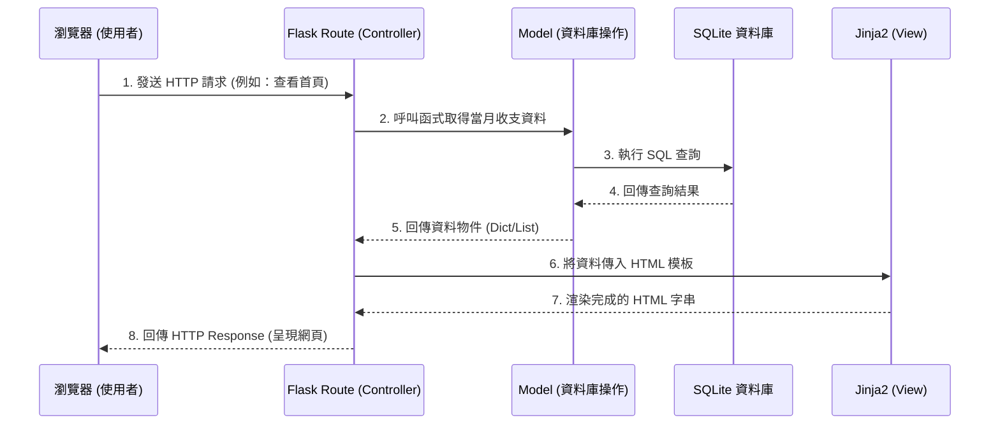

# 系統架構設計 (ARCHITECTURE) - 個人記帳簿系統

## 1. 技術架構說明
本專案採用經典的伺服器端渲染 (Server-Side Rendering) 架構，不採用前後端分離，以求快速開發與簡化的部署流程。

- **後端架構：Python + Flask**
  選用 Flask 是因為其輕量、彈性高的特性，非常適合個人記帳簿這種功能單純的 MVP 系統。
- **模板引擎：Jinja2**
  與 Flask 完美整合，負責在後端將資料與 HTML 結合後，直接回傳渲染好的頁面給瀏覽器，降低前端開發複雜度。
- **資料庫：SQLite**
  無需額外架設資料庫伺服器，資料儲存在單一檔案中，適合單機/小型應用與快速開發。
- **架構模式：MVC (Model-View-Controller) 變體**
  - **Model (資料模型)**：負責定義資料結構與操作 SQLite 資料庫（例如：存取收支紀錄、計算餘額）。
  - **View (視圖)**：Jinja2 HTML 模板，負責介面呈現。
  - **Controller (控制器)**：Flask 的 Route，負責接收請求、調用 Model 取得資料，再將資料傳遞給 View 進行渲染。

## 2. 專案資料夾結構

```text
web_app_development2/
├── app/                        # 主要的應用程式邏輯目錄
│   ├── __init__.py             # 初始化 Flask 應用程式
│   ├── models/                 # 資料庫模型與操作 (Model)
│   │   ├── __init__.py
│   │   └── transaction.py      # 收支紀錄的資料庫操作邏輯
│   ├── routes/                 # Flask 路由控制器 (Controller)
│   │   ├── __init__.py
│   │   ├── index.py            # 首頁與總覽路由
│   │   └── transaction.py      # 收支紀錄相關 (新增/修改/刪除) 路由
│   ├── templates/              # Jinja2 HTML 模板 (View)
│   │   ├── base.html           # 共用版型
│   │   ├── index.html          # 首頁 (含圖表與餘額)
│   │   ├── add.html            # 新增收支頁面
│   │   └── history.html        # 歷史紀錄查詢與修改頁面
│   └── static/                 # CSS / JS 等靜態資源
│       ├── css/
│       │   └── style.css       # 全域樣式 (極簡風格)
│       └── js/
│           └── main.js         # 前端互動或圖表渲染邏輯
├── instance/                   # 存放運行時產生的檔案
│   └── database.db             # SQLite 資料庫檔案
├── docs/                       # 專案文件
│   ├── PRD.md                  # 產品需求文件
│   └── ARCHITECTURE.md         # 系統架構文件 (本檔案)
├── app.py                      # 程式進入點 (負責啟動 Flask 伺服器)
└── requirements.txt            # Python 套件依賴清單
```

## 3. 元件關係圖

以下展示使用者如何與系統互動的流程：



## 4. 關鍵設計決策

1. **不使用 SQLAlchemy 等大型 ORM**：
   - **原因**：為了符合「極簡」的開發精神與效能考量，初期僅依賴內建的 `sqlite3` 或輕量封裝即可滿足需求，降低學習與設定成本。
2. **採用 Server-Side Rendering (SSR)**：
   - **原因**：對於大學生的記帳系統，重點在於快速載入與操作流暢。不採用前後端分離架構，能減少開發時間並避免跨域等複雜問題，讓開發更專注在業務邏輯與 Jinja2 的模板撰寫。
3. **資料庫置於 `instance/` 資料夾**：
   - **原因**：這符合 Flask 的官方最佳實踐。`instance/` 內通常存放不該被加入 Git 版本控制的檔案（例如實際的資料庫檔案 `database.db`），可以避免敏感資料上傳至公開的程式碼儲存庫。
4. **CSS 採用純手工或極簡框架**：
   - **原因**：不依賴過度肥大的框架，以確保達到「極簡操作介面」且載入迅速的要求，並確保未來容易擴充獨特的動態效果。
