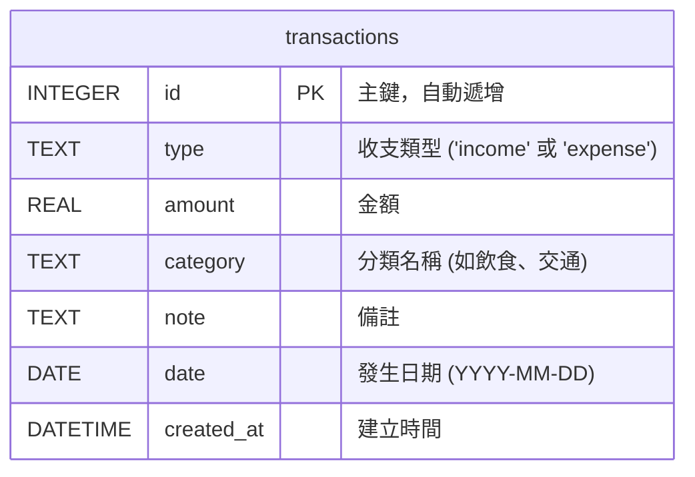

# 資料庫設計 (DB Design) - 個人記帳簿系統

## 1. ER 圖（實體關係圖）
本專案採用極簡設計，初期僅需要單一 `transactions` 資料表來儲存所有收支紀錄。為了降低複雜度，分類（category）直接作為文字欄位儲存，不額外建立分類表。

## 2. 資料表詳細說明

### `transactions` (收支紀錄表)
| 欄位名稱 | 型別 | 必填 | 說明 |
| --- | --- | --- | --- |
| `id` | INTEGER | 是 | 主鍵 (Primary Key)，自動遞增 |
| `type` | TEXT | 是 | 交易類型，限制為 'income' (收入) 或 'expense' (支出) |
| `amount` | REAL | 是 | 交易金額 |
| `category` | TEXT | 是 | 交易分類（例：飲食、交通、薪水） |
| `note` | TEXT | 否 | 額外備註說明 |
| `date` | TEXT | 是 | 交易發生日期，格式為 `YYYY-MM-DD` |
| `created_at` | TEXT | 是 | 系統建立時間，預設為 CURRENT_TIMESTAMP |

## 3. SQL 建表語法
完整的建表語法已儲存於 `database/schema.sql`，系統啟動時可執行該腳本以初始化資料庫。

## 4. Python Model 程式碼
根據架構文件的決策，專案不使用大型 ORM，改採內建的 `sqlite3`。相關程式碼已建立於 `app/models/` 目錄中：
- `app/models/__init__.py`：處理資料庫連線與初始化邏輯。
- `app/models/transaction.py`：包含 `transactions` 資料表的 CRUD（建立、讀取、更新、刪除）方法，並額外實作了 `get_summary` 來統計當月收支與餘額。
