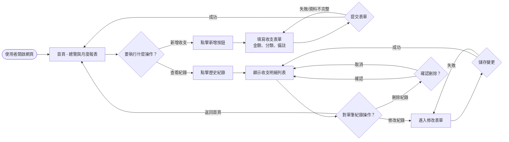
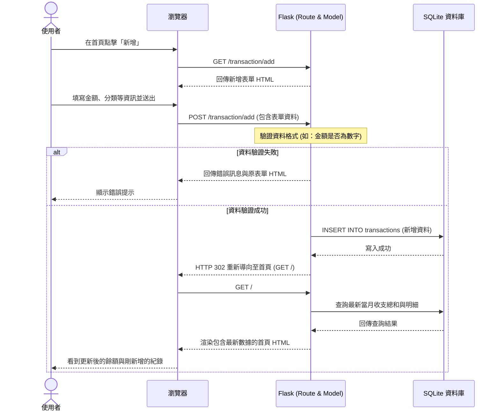

# 流程圖設計 (FLOWCHART) - 個人記帳簿系統

## 1. 使用者流程圖（User Flow）
此流程圖描述使用者進入記帳系統後，可以進行的各項操作路徑。

## 2. 系統序列圖（Sequence Diagram）
以「使用者新增一筆收支紀錄」為例，展示前端瀏覽器、Flask 後端與 SQLite 資料庫的完整資料流互動。

## 3. 功能清單對照表
此表對應了 PRD 中定義的核心功能，與接下來即將實作的 URL 路由規劃。

| 功能名稱 | URL 路徑 | HTTP 方法 | 說明 |
| --- | --- | --- | --- |
| 首頁與月度報表總覽 | `/` | GET | 顯示當月總收入、總支出、餘額與統計圖表 |
| 進入新增收支頁面 | `/transaction/add` | GET | 顯示填寫收支紀錄的表單頁面 |
| 處理新增收支請求 | `/transaction/add` | POST | 接收表單資料並存入資料庫，成功後回首頁 |
| 歷史紀錄明細查詢 | `/history` | GET | 顯示所有過去的收支明細列表 |
| 進入修改收支頁面 | `/transaction/edit/<id>` | GET | 根據紀錄 ID 顯示預填舊資料的修改表單 |
| 處理修改收支請求 | `/transaction/edit/<id>` | POST | 更新資料庫中特定 ID 的紀錄，成功後回歷史列表 |
| 處理刪除收支請求 | `/transaction/delete/<id>` | POST | 刪除資料庫中特定 ID 的紀錄，成功後回歷史列表 |
